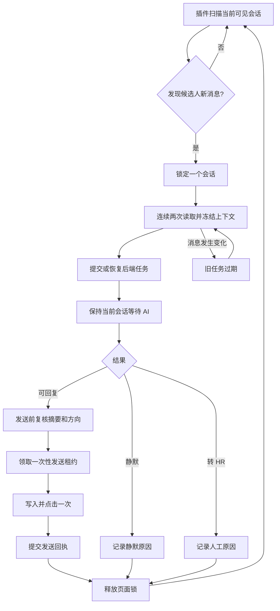

# 自动招聘系统简化与稳定性优化计划

## 1. 文档信息

| 项目 | 内容 |
| --- | --- |
| 文档状态 | 第一阶段已实施，后续阶段按验收口径推进 |
| 适用范围 | BOSS 插件、自动回复后端、简历处理、聊天记录同步、今日值守 |
| 核心目标 | 在保留安全校验和现有业务能力的前提下，缩短回复路径，减少插件状态和队列复杂度 |
| 主链路 | 发现未读 → 读取上下文 → AI 判断 → 回复或转 HR → 确认结果 → 下一条 |
| 本阶段原则 | 先收敛职责和状态，再优化速度；不因为增加一个问题场景就增加一套独立队列 |

本文件同时作为实施基线。已完成的改动必须在代码、测试和运行日志中可验证；未完成的阶段继续保持计划状态，不以“代码已改”代替线上验收。

### 当前实施记录（2026-09-29）

- P0 单页面单当前任务：插件页侧预取窗口收敛为 1；恢复时只选择一个任务，READY/SEND 优先；AI 等待期间不扫描或切换其他会话。
- P0 任务状态：插件日志增加统一 `taskState`，并由后台桥接校验后保存；原有阶段日志仍保留，便于兼容现有诊断。
- P0 状态展示：后台运行态和插件弹窗直接暴露同一组十态；页面隐藏、READY、发送确认和转 HR 不再只显示模糊的“处理中”。
- P1 队列容量：移除单招聘账号待处理数量上限，保留全局容量、单账号 AI 并发和页面发送租约。
- P1 可观测性：AI 分析完成日志补充任务耗时；今日值守与运行日志接口同步返回处理耗时；历史文档与当前开发状态分离归档。

本次不修改数据库结构，不放宽发送前摘要/方向校验，不改变 `UNKNOWN` 禁止重发规则。

## 2. 目标与验收口径

### 2.1 产品目标

每个候选人消息都必须进入一个可追踪的最终状态：

- 已回复。
- 明确静默，并记录原因。
- 转交 HR，并记录原因。
- 失败，并记录可恢复性。
- 发送结果待确认，并明确禁止重复发送。

插件处理一条会话时，必须保持当前会话不切换；只有当前任务结束，才开始下一条会话。

### 2.2 性能目标

以下指标作为上线前后的统一验收口径，具体数值可根据真实模型延迟调整：

| 指标 | 目标 |
| --- | --- |
| 发现消息到提交分析 | P95 ≤ 1 秒 |
| AI 返回到开始发送 | 页面可操作时 P95 ≤ 3 秒 |
| 同一消息重复分析 | 0 |
| 同一消息重复发送 | 0 |
| 点击发送后自动重发 | 0 |
| 无理由静默 | 0 |
| READY 等待超过 30 秒 | < 1% |
| 页面恢复可见后继续处理 | ≤ 15 秒 |
| 简历接收记录重复 | 0 |
| 聊天记录重复导入 | 0 |

### 2.3 稳定性目标

- 插件连续运行时，任务不会因为页面刷新、标签页暂时隐藏或一次网络异常而丢失。
- 后端任务状态是唯一事实来源，插件本地状态只做页面操作缓存。
- 任意异常都能通过任务 ID、账号、会话摘要和阶段日志定位。
- 账号、企业、岗位、会话、简历和聊天记录严格隔离。

## 3. 当前复杂度与主要问题

当前实现已经具备“扫描 → 持久化 AI 任务 → AI → 发送租约 → 页面发送 → 回执”的安全链路，但插件还同时承担了多种调度职责。

### 3.1 插件端复杂点（阶段一前的基线）

- 实时会话预取窗口曾最多保存 5 条消息。
- 本地曾同时维护 ANALYSIS、SEND、REVALIDATION 等队列；阶段一已收敛为 currentTask 的单一 lane。
- 当前会话 AI 等待、READY 深度定位和历史会话复核互相竞争页面。
- AI 结果返回后可能已经离开原会话，需要重新滚动列表定位。
- 发送终态后才采集完整聊天记录，采集期间会占用页面锁。
- 简历预览关闭、文件上传、收件回复、历史采集都有独立等待状态。
- 页面最小化或隐藏时会暂停 DOM 写操作，恢复时需要重新唤醒。

这些机制单独看都有作用，但同时存在时，容易出现“任务已经准备好，插件却在扫描列表”“新消息已经到达，旧任务还在等待”“页面看起来没有报错但循环不再前进”等问题。

### 3.2 后端端复杂点

- 后端已经保存任务和发送租约，但插件也保存了大量任务副本。
- `COMPLETED`、`READY`、`CLAIMED`、`UNKNOWN` 等分析状态和发送状态组合较多，前端展示容易误解。
- AI 并发、页面发送顺序和简历分析队列的边界还需要明确。
- 历史聊天导入、示例库导入和实时回复共享部分页面时序，但业务优先级不同。

### 3.3 不应继续增加的复杂度

- 不再为每个新话术增加一个插件分支。
- 不再让插件和后端各自决定任务优先级。
- 不再用未读角标单独判断会话是否已经处理。
- 不再把完整聊天记录采集、简历 OCR 和历史复核放入实时回复关键路径。
- 不再用页面上显示的“送达”“已读”等辅助文本判断发送成功。

## 4. 目标架构



### 4.1 插件只做页面执行

插件保留以下职责：

1. 判断页面是否可操作。
2. 发现未读或当前会话的新消息。
3. 打开并读取一个会话。
4. 向后端提交冻结快照或查询已有任务。
5. 领取发送租约，操作输入框和发送按钮。
6. 报告发送结果和页面状态。
7. 页面恢复可见后继续未完成任务。

插件不负责 AI 分类、聊天记录入库、简历 OCR、历史任务恢复策略和业务话术规则。

### 4.2 后端作为任务唯一事实源

每条任务至少包含：

- `taskId`
- `accountId`
- `deviceId`
- `chatDigest`
- `messageDigest`
- `jobPositionId`
- `processingToken`
- `status`
- `sendStatus`
- `attemptCount`
- `lastErrorCode`
- `createdAt`、`completedAt`、`sendClaimedAt`、`sendCompletedAt`

同一账号、同一会话、同一消息摘要只能生成一个有效任务。旧任务不能覆盖新消息，旧 AI 结果不能越过发送前摘要校验。

## 5. 插件主链路改造计划

### P0：统一为单当前任务

目标：同一个 BOSS 页面一次只操作一个会话。

实施内容：

- 实时链路取消多会话预取，先不使用 5 条预取窗口。
- 插件本地只保留一个 `currentTask` 和一个页面操作锁。
- 后端已有 READY 任务优先恢复。
- 当前任务等待 AI 时不打开其他会话。
- 候选人补发新消息时，旧任务标记过期，当前会话重新读取上下文。
- 只有任务进入终态后才释放锁并开始下一条。

验收：处理 A 会话时不会打开 B；A 完成或转 HR 后才处理 B。

### P0：统一页面状态机

插件状态只保留以下状态：

```text
IDLE
READING
AI_PROCESSING
READY_TO_SEND
PRE_SEND_CHECK
SENDING
CONFIRMING
WAITING_PAGE
WAITING_HR
FINISHED
```

所有旧的“等待、恢复、深度扫描”日志都映射到这些状态，不再为每个异常创建新的队列名称。

### P0：简化任务恢复

- 当前会话存在任务时，优先查询结果，不重复提交 AI。
- 已经有 READY 结果时，直接定位、复核、发送。
- READY 定位失败时只保留一个可恢复任务，不重复生成定位任务。
- 页面不可见时进入 `WAITING_PAGE`，不把它当成失败。
- 任务恢复超过规定时间后转 `WAITING_HR`，保留原因和最后阶段。

## 6. AI 回复准确性计划

### 6.1 资料优先级

AI 使用以下固定优先级：

1. 已审核岗位资料。
2. 岗位对应话术文件。
3. 真实历史成功对话。
4. 通用语言理解。

岗位资料中没有的信息不得自行编造。薪资、福利、上班时间、地点、试岗和住宿等事实必须带来源。

### 6.2 会话阶段识别

每次 AI 判断都要识别当前阶段：

- 初次沟通。
- 求职意向确认。
- 求简历。
- 简历已发送。
- 简历已收到。
- 岗位细节咨询。
- 联系方式交换。
- 面试安排。
- 面试结果询问。
- 已约面试后的跟进。
- 候选人拒绝。
- 等待 HR 处理。

已发简历后，后续消息不能继续套用“请发送简历”。已约面试后，普通“好的”不能覆盖人工处理阶段。

### 6.3 结构化 AI 输出

```json
{
  "action": "REPLY",
  "category": "JOB_CONSULTATION",
  "reply": "回复内容",
  "confidence": 0.96,
  "reason": "岗位资料中存在对应事实",
  "requiresHuman": false
}
```

模型层的 `action` 保留现有实现所需的五个值：

- `REPLY`：基于岗位事实或固定话术回复。
- `ASK_CLARIFICATION`：与岗位有关但缺少具体问题时，先追问范围。
- `REQUEST_RESUME`：尚未收到简历且候选人表达明确求职意向时索要简历。
- `NO_REPLY`：明确的礼貌确认或自然收尾，不继续机械接话。
- `HANDOFF_TO_HR`：面试安排/结果、投诉争议、敏感信息或事实不足，转 HR。

任务层再将这些动作收敛成 `REPLY`、`SILENT`、`HR_REQUIRED`、`RETRY`、`EXPIRED` 等可追踪结果；`RETRY` 和 `EXPIRED` 不作为模型直接输出。中等置信度消息优先使用安全、自然的确认或补充询问；涉及面试安排、面试结果、投诉、争议和无法确认的岗位事实时转 HR。

## 7. 发送安全与二次复核

二次复核不能全部删除，但必须从“反复重试”收敛为一次发送前关卡。

发送前只检查：

- 当前会话摘要一致。
- 最后一条消息摘要一致。
- 最后一条消息方向仍为候选人。
- 岗位和招聘账号一致。
- 输入框为空。
- 发送按钮唯一可用。

不同结果的处理方式：

| 情况 | 处理 |
| --- | --- |
| AI 请求暂时失败 | 有限重试，超过次数转 HR |
| AI 内容不合规 | 重新请求一次，仍失败转 HR |
| 发送前消息变化 | 旧任务过期，重新读取最新消息 |
| 页面找不到输入框 | 保留 READY，稍后恢复 |
| 已点击但结果不明 | 记录 `UNKNOWN`，禁止自动重发 |
| 已确认发送成功 | 结束任务，不再复核同一消息 |
| 明确静默或转 HR | 结束任务，不重复分析 |

## 8. 简历处理计划

目标链路：

```text
识别当前会话简历
→ 校验会话和附件摘要
→ 快速建立简历接收记录
→ 收件回复进入主链路
→ OCR、文本提取、AI 分析后台执行
→ 写入人才库
```

插件只处理页面上的附件识别、打开、读取和关闭。后端负责文件校验、去重、OCR、文本提取和分析。

简历收件回复必须绑定：

- 当前会话摘要。
- 当前附件消息摘要。
- `resumeIntakeId`。
- 简历接收状态。

不能因为重新打开历史简历预览就再次发送收件确认。

## 9. 聊天记录和示例库同步

实时回复完成后，聊天记录再进入后台同步：

1. 冻结当前会话快照。
2. 释放页面锁。
3. 异步导入沟通时间线。
4. 异步导入示例库。
5. 失败时依据冻结快照重试。

消息去重统一使用：

```text
boss:<messageDigest>
ai-task:<taskId>
```

导入内容只保留候选人和 HR 的真实消息，去除“送达”“已读”、时间控件、按钮和页面状态文本。

## 10. 扫描策略

### 实时扫描

只扫描：

- 当前会话是否出现候选人新消息。
- 列表中是否出现新的未读会话。
- 当前 READY 任务是否需要恢复。

发现一条可处理消息后立即停止扫描并进入主链路。

### 历史扫描

只有实时任务为空时才运行：

- 已读未回复核。
- 历史完整聊天记录采集。
- 旧失败任务定位。
- 示例库补采集。

历史扫描必须分片、保存游标并限制单轮耗时，不能每轮从列表顶部重新扫描。

## 11. 页面最小化与长期运行

浏览器页面不可见时，插件不应继续点击 BOSS 页面 DOM。

正确处理方式：

- 页面隐藏进入 `WAITING_PAGE`。
- 后端任务继续保留。
- 不创建重复任务。
- 不把页面隐藏当成发送失败。
- `visibilitychange` 恢复后立即查询 READY 任务。
- 看门狗只允许一次恢复流程，避免多个恢复循环互相抢锁。
- 多次恢复失败后转 HR，并展示最后暂停原因。

如果浏览器或 BOSS 平台本身禁止后台 DOM 操作，系统只能做到“任务不丢、恢复后继续”，不能承诺最小化状态下仍然点击发送。

## 12. 数据隔离和权限

所有任务、观察记录、聊天记录、简历和岗位都必须同时绑定：

- 企业。
- 招聘账号。
- 设备。
- 当前用户权限。

插件请求每次都校验设备令牌、招聘账号和会话归属。前端展示只使用后端已经过滤后的数据，不能在前端通过隐藏字段实现隔离。

## 13. 分阶段实施顺序

### 阶段一：主链路收敛（P0）

- 单页面单当前任务。
- 去掉实时预取窗口。
- READY 优先恢复。
- 统一插件状态机。
- 保留发送前摘要校验和一次性租约。

验收重点：不串会话、不重复提交、不重复发送。

### 阶段二：后台任务解耦（P0）

- 聊天记录异步导入。
- 示例库异步导入。
- 简历 OCR 和分析异步执行。
- 页面锁只保护 BOSS 页面操作。

验收重点：后台导入失败不阻塞下一条回复。

### 阶段三：AI 质量统一（P1）

- 固定话术快速路径。
- 统一会话阶段。
- 岗位事实和话术文件统一上下文。
- 已发简历、已约面试和面试结果场景专项校验。
- 所有静默和转 HR 都记录原因。

验收重点：减少错误套用旧模板，减少无理由静默。

### 阶段四：长期运行保障（P1）

- 页面隐藏恢复。
- READY、PROCESSING、UNKNOWN 超时监控。
- 任务阶段耗时统计。
- 账号级和设备级隔离检查。
- 今日值守展示成功、静默、失败、重试和处理中状态。

验收重点：运行数小时后仍能继续处理新消息。

### 阶段五：谨慎并发（P2）

- 不同账号和不同标签页并行。
- 后端对已经冻结的快照做有限并发分析。
- 页面发送始终串行。

只有阶段一至四稳定后才开启，默认通过功能开关控制。

## 14. 监控和日志

每个阶段日志只记录：

- `taskId`
- 账号标识摘要
- 会话摘要前缀
- 当前阶段
- 耗时
- 结果码
- 原因码

日志不能保存候选人姓名、电话、聊天正文、简历内容、Cookie 或令牌。

重点监控：

- `READY` 等待时间。
- `UNKNOWN` 比例。
- `PRE_SEND_BLOCKED` 次数。
- 页面隐藏时长。
- 页面恢复后成功继续次数。
- AI 请求失败和重试次数。
- 简历导入成功率。
- 聊天记录重复导入数。

## 15. 发布、回滚和验收

每个阶段单独发布，使用功能开关控制：

1. 先部署后端兼容代码。
2. 再更新插件。
3. 观察单个测试账号。
4. 验证实时消息、简历、静默、发送待确认和页面恢复。
5. 扩大到其他账号。
6. 最后删除已经确认无用的旧分支。

回滚要求：

- 后端数据库迁移可向后兼容。
- 新旧插件都能识别任务状态。
- 旧任务不会因版本切换而重复发送。
- `UNKNOWN` 任务永远不能因为回滚自动重发。
- 保留旧镜像和部署健康检查。

## 16. 明确不做的事情

- 不以增加更多关键词分支作为主要智能化方案。
- 不在插件端复制后端 AI 判断逻辑。
- 不为了提高并发而让同一个页面同时打开多个会话。
- 不删除发送前最后一次校验。
- 不把发送结果不明的消息强行标记为成功。
- 不用“看起来运行中”代替任务阶段和实际结果。

## 17. 最终判断

系统的最佳形态是：

```text
插件：一个页面操作员
后端：一个任务状态源
AI：一个结构化决策器
后台任务：独立运行
发送：一次租约、一次点击、一次回执
```

先把单页面主链路做到清晰、稳定、可恢复，再增加跨账号并行和快路径优化。这样可以同时提升速度、回复准确性和长时间运行稳定性，也能避免每遇到一个新问题就继续增加插件队列和特殊分支。

## 18. 实施时的代码入口

| 模块 | 入口 | 计划关注点 |
| --- | --- | --- |
| 插件主循环 | [`content.js`](../boss-browser-bridge/src/content.js) | 单当前任务、页面锁、扫描和发送状态机 |
| 插件后台桥接 | [`background.js`](../boss-browser-bridge/src/background.js) | 请求转发、发送租约、结果回执和页面恢复 |
| AI 任务队列 | [`InboundAiReplyQueueService.java`](../backend/src/main/java/ai/xzkj/recruitment/localconnector/InboundAiReplyQueueService.java) | 任务唯一状态源、幂等、恢复和 READY 调度 |
| AI 决策 | [`InboundJobReplyService.java`](../backend/src/main/java/ai/xzkj/recruitment/localconnector/InboundJobReplyService.java) | 会话阶段、岗位事实、模板和结构化结果 |
| 简历处理 | [`ResumeDocumentPipelineService.java`](../backend/src/main/java/ai/xzkj/recruitment/resumes/ResumeDocumentPipelineService.java) | 接收确认与 OCR、提取、分析解耦 |
| 今日值守 | [`DashboardView.vue`](../frontend/src/views/DashboardView.vue) | 任务阶段、耗时、静默原因和异常状态展示 |

实施每个阶段前，先对照本表确认影响范围；阶段完成后按第 2 节指标和第 15 节发布验收，不把“代码已改”直接视为“线上已验证”。
